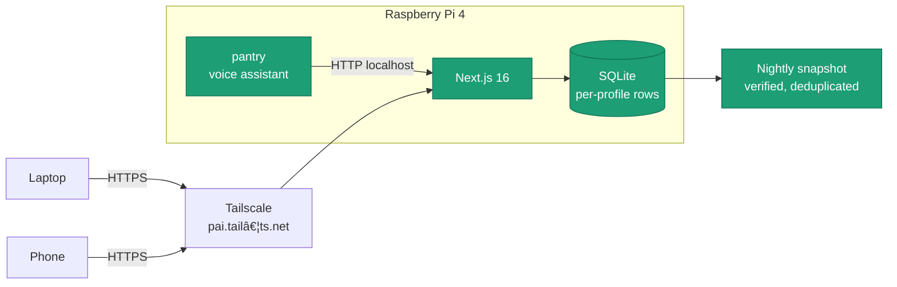
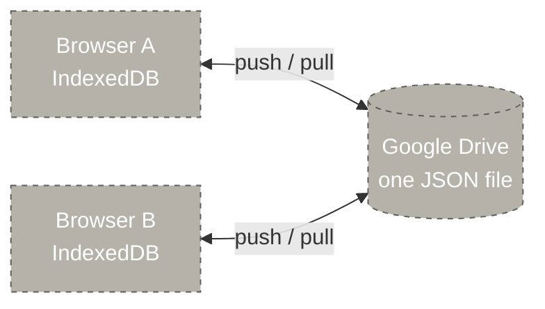
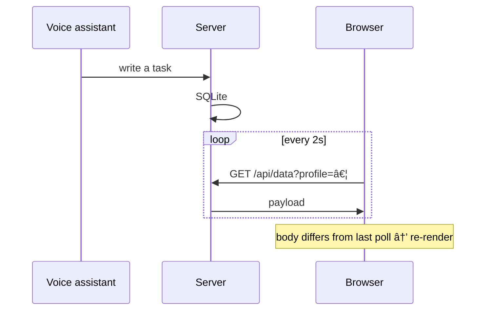

# Architecture

LifeOS began as a local-first PWA: data in IndexedDB, synced to Google Drive,
no server. It now runs on a Raspberry Pi that holds the only authoritative
copy, so it can be reached from any device and driven by a voice assistant on
the same box.

## Now



## Was



Each browser held its own copy and reconciled through a single JSON file in
Drive. Two devices pushing near-simultaneously meant the loser lost the whole
changeset, not just conflicting rows. The Pi cannot read another device's
IndexedDB, so a voice assistant had nothing to talk to.

## Storage

One row per record. The fields worth querying are projected into columns and
full fidelity is kept in a JSON blob, so the schema tolerates changes in the
app while another process on the box — the voice assistant — can still run
real queries.

```
records(userId, collection, id, name, status, dueDate, domainId,
        updatedAt, deletedAt, data)
```

Every profile's rows are keyed by `userId`, and nothing reads across
profiles. Deletion is a tombstone (`deletedAt`), not a removal.

## Live updates



Polling, not server-sent events: a dropped stream needs reconnect and backoff
logic, and an unchanged poll costs one round trip and no re-render because
the raw body is compared before parsing. Polling stands down while the tab is
hidden and while a write is in flight, since an optimistic change on screen
is newer than anything the server can report.

## What the migration cost

Centralising removed the redundancy that local-first gave for free. Every
copy of the data now lives on one SD card, so snapshots run nightly —
deduplicated by content hash, size-capped, and integrity-checked — and the
app asks once a month for a copy to be taken off the device.
